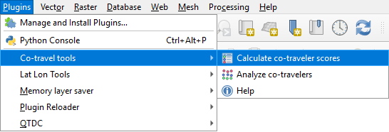
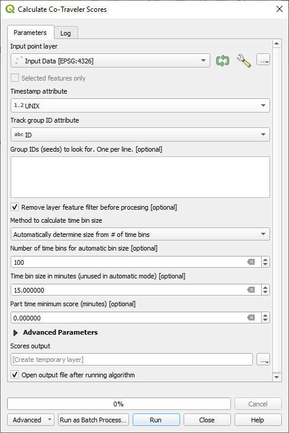
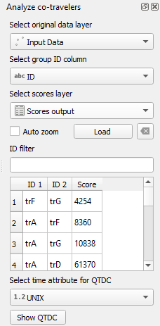

# QGIS Co-traveler Plugin

Co-traveler problems are generally concerned with discovering a set of objects which travel together from among a collection of moving objects. The data is in the form of timestamped locations, along with an identifier of the object that the timestamped locations belong to. The data is grouped according to these identifiers into tracks, where each track is a collection of timestamped locations. The cotravel plugin computes distances (scores) between tracks. Here is a simple example.

The distance between these two tracks "A" and "B" above is calculated by averaging the 5 sampled distances (an oversimplification for now, a more accurate explanation later), marked in the image below with dotted lines, 

resulting in a score of (4+3+2+2+3)/5 = 3 grid units. How these samples were chosen is determined by the parameter time bin size, to be further explained later below. (Here time bin size was set to 1 hour.) Here are some definitions:

* A ***ping***, also known as a ***point***, is a timestamped coordinate.
* A ***track*** is a sequence of pings ordered by time.

Note that the distances between tracks "A" and "B" were computed only for the time period where both tracks existed. In this example, tracks "A" and "B" *overlapped* during the time period from 4:00 to 8:00.  The algorithm returns the following information for the track pair (A, B).

* ID 1: A
* ID 2: B
* score: 3
* overlap_start: unix timestamp number that corresponds to 4:00
* overlap_stop: unix timestamp number that corresponds to 8:00
* diameter_common: 7.35, the farthest apart two points are during the overlapping time period
* total_distance: 7.53, the average of the distances traveled by the two tracks, not just during the overlapping time period.

For contrast, if we change the timestamps of track "A" and call the new track "C", the score between tracks "C" and "B" below would be "nonexistent" because the two tracks do not overlap in time.

For applications where we are interested in vehicles that are near each other only part-time, we can also set the *minimum part-time window* parameter. This score is the best (smallest) distance averaged over all possible time windows of at least this size. For example, using the example of tracks "A" and "B" above, 

* *minimum part-time window* = 2 hr yields score = (2+2)/2 = 2 grid units
* *minimum part-time window* = 4 hr yields score = (3+2+2+3)/2 = 2.5 grid units
* *minimum part-time window* = 5 hr yields score = (4+3+2+2+3)/2 = 3 grid units
* *minimum part-time window* = 6 hr yields score = nonexistent

## Quick explanation of algorithm and time bin size

The most important parameter is the time bin size. The algorithm converts each track to a track of ***quantized pings (qpings)***, with one ***qping*** per ***time bin***. (A qping of a time bin is calculated as the centroid of the track within that time bin; but that's not important here.) These converted tracks of qpings are what allows the algorithm to compute various scores quickly. Here are some example results of the track "A" with various time bin sizes. 

* The actual path that gave rise to track "A": 

* qpings when time bin size = 60 minutes: 
  For convenience, we denote a time bin by the midpoint of the time bin. For example in this diagram, 7:00 indicates the 60 minute time bin from 6:30 to 7:30.
The qping for this time bin is the centroid of the path during this time bin; note the qping might not be on the path because the qping is the average location during this time bin.

* qpings when time bin size = 30 minutes: 

* qpings when time bin size = 120 minutes: 

An optimal choice of time bin size depends on the nature of the data, and properties such as density,speed, and quality. A reasonable first try is to choose a time bin size so as to get approximately 100 time bins. An alternate to choosing the time bin size is to choose the number of time bins; the default option is to choose 100 time bins. A begnning user of this plugin can simply use this default option.

## Calculate co-traveler scores

Co-travel analysis begins by selecting ***Plugins->Co-travel tools->Calculate co-traveler scores*** from the QGIS menu or by clicking on this icon on the toolbar .

Once launched this dialog box is displayed.

This algorithm processes a point vector layer that contains pings that have a timestamp and unique identifier representing the same object traveling in space and time. The unique identifier groups are called *tracks* and the pings are sorted in the track by their timestamp. The algorithm output is a table that gives scores to pairs of tracks which best match the criteria that they are near each other in both time and space. After the scores are calculated the **Analyze co-travelers** tool will be displayed to examine co-travel pairs.

The following are the plugin parameters necessary to run the algorithm.  Some are mandatory and some are optional.

### Mandatory input parameters

* **Input point layer:** *(required)* Select an input point layer to be processed.
* **Timestamp attribute:** *(required)* This specifies the attribute in the input point layer that represents a date and time. This can be a numerical UNIX (Epoch) timestamp, QGIS QDateTime object, or an ISO8601 string format. This algorithm will attempt to parse other date and time string formats, but these might not be accurately interpreted.

* **Track group ID attribute:** *(required)* This specifies the attribute in the input vector layer that represents the unique identifier that is used to cluster pings into tracks.

* **Group IDs (seeds) to look for:** *(optional)* (May leave blank as default.) If there are unique group identifiers of interest, co-travel track comparisons will only be made using these identifiers against the rest of the tracks, including the other seeds.

### Important parameters, though defaults values may be used.

* **Remove layer feature filter before processing:** (May use default value) The interactive analysis tool use filters on the data to view feature pairs. This can lead to problems if the layer has a filter when this algorithm is run, causing only the filtered features to be processed. When checked, this makes sure that there is no filter so all the data is processed.

* **Method to calculate time bin size:** (May use default value)  If *Automatically determine size from # of time bins* is selected then the time bin size will be calculated as follows (maximum_time - minimum_time) / number_of_time_bins. If *Manually enter time bin size* is selected then *Number of time bins for automatic bin size* is ignored and the value in *Time bin size in minutes* is used.

* **Number of time bins for automatic bin size:** (May use default value) This is only used when *Automatically determine size from # of time bins* has been selected above.

* **Time bin size in minutes:** (May use default value)  This is only used when *Manually enter time bin size* has been selected above. This specifies the time bin size in minutes. 

* **Part time minimum score (minutes):** (Optional - may use default value of 0)  If this is 0, the algorithm will not do part time scoring. If it is non-zero, as explained above, it specifies the minimum time two objects must exist together and the score is the best (smallest) distance averaged over all possible windows of this size. That is, two objects must be near each other for at least this amount of time to have a good score.

### FILTERS (Advanced Parameters)

* **Maximum allowed score (meters):** (May use default value of 20000) This filters output track pairs whose score is greater than this value. Remember that the score approximates the average distance that the two objects are apart during the times that both tracks exist.  Large scores indicate that the track pairs are not traveling together.  It is recommended that this is set to a reasonable number if there are many tracks.

* **Minimum pings per track:** (May use default value of 2) This filters input tracks with number of pings fewer than this number. 

* **Maximum velocity in meters per second:** (May use default value of 500)  This filters pings in tracks. This is the maximum speed between two pings that is acceptable. Anything faster than this is ignored. This helps to remove bad pings.

* **Minimum pings per time bin:** (May use default value of 0) This filters quantized pings by requiring a quantized ping's time bin to contain at least this many original pings. This is best used when comparing dense tracks to extremely sparse tracks - to be explained and implemented in future version. It is best to leave this at 0 for now.

* **Minimum diameter (meters):** (May use default value of 0) This filters input tracks.  This is useful if we wish to ignore objects that do not move much. Ignore tracks whose diameter in meters is less than this value. The diameter of a track is the maximum distance between two of its pings.

* **Minimum qpings:**  (May use default value of 2) This filters input tracks. Ignore a track if it exists in time bins fewer than this number.

* **Minimum common qpings:** (May use defult value of 2) This filters output track pairs. Ignore a pair if both tracks exist together in fewer time bins than this number.  That is, we require a track pair to exist simultaneously for at least this many time bins.

## Analyze co-travelers

This tool is automatically enabled and populated when the **Calculate co-traveler scores** algorithm is finished, but it can also be launched from the Co-travel plugin menu or from the toolbar.

* **Select original data layer** This specifies the point vector layer that was used in the algorithm to calculate the co-traveler scores.

* **Select group ID column** This is the same group ID used in the algorithm to calculate the co-traveler scores.

* **Select scores layer** This is the output table from running the calculate the co-traveler scores algorithm. The important components to this table are the two group IDs or track pairs and their score that may be co-traveling pairs.

* **Load** This loads the scores layer into the interactive table.

* **Auto zoom** When this is checked and one of the co-traveling pairs are clicked in the table, then QGIS will zoom to fill the canvas with the pairs.

* **ID filter** If an ID is entered into this box and the *Enter* key is pressed, this will filter the table below with only those pairs where the ID matches either **ID 1** or **ID 2**.

### QGIS Time Date Controller support

If the ***QGIS Time Date Controller (QTDC)*** plugin has been installed, then ***Analyze co-travelers*** has additional functionality to interact with that controller. The only parameter is to select the time attribute that was used in the original data when the scores were processed. Clicking on **Show QTDC** will display the controller. If the ***QTDC*** plugin has not been installer, then these extra capabilities will not be displayed.
